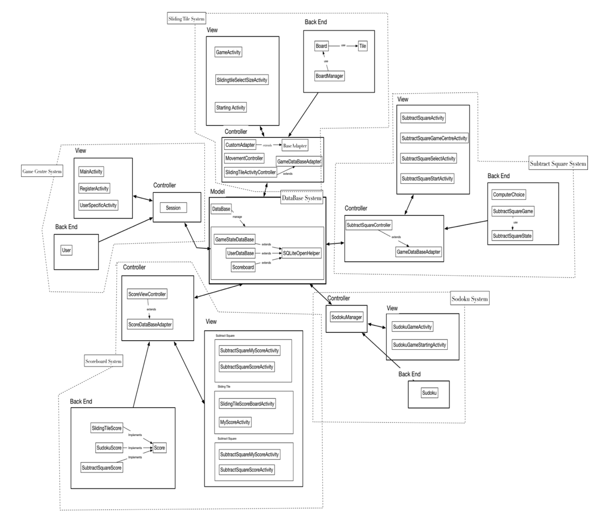

# Overview
A game centre application implemented in Java. There are three built-in games:
- Sliding Tile
- Sudoku
- Subtract Square (has AI mode with mini-max strategy)

The app is developed with local database which stores different users information such as saved game state, game scores etc. Also provides socket for more games.

# OOP-Design

# Functionalities
## Game Centre
1. log in/ sign up: user can choose to create a new account if he hasn't got one or log in directly.
2. delete account: user can choose to delete his account in the user specific interface.
3. delete game data: user can choose to delete his game data

## Sliding Tile Game
1. Start new game: start a new sliding tile game.
2. load saved game: load the previous saved game.
5. select difficulty level: player can choose either 3*3 or 4*4 or 5*5 sliding board game, representing relatively easy, medium and difficult.
6. save game: save current game state.
7. undo: user can undo the move he just made.
8. time counting: the game shows time counting.

## Sudoku Game
1. Start new game: start a new sliding tile game.
2. load saved game: load the previous saved game.
5. select difficulty level: player can choose difficulty.
6. auto save: the state can be autosaved.
7. undo: user can undo the move he just made.
8. time counting: the game shows time counting.
9. user can choose to generate a new board.

## Subtract Square Game
1. Start new game: start a new sliding tile game.
2. load saved game: load the previous saved game.
5. pc mode: player can choose to play with computer.
6. auto save: the state can be autosaved.
7. undo: user can undo the move he just made.
8. time counting: the game shows time counting.
9. user can choose to generate a new board.
10. payment: if player's undo exceed 3 times, he wil be directed to payemnt interface:

## Scoreboard:
1. scoreboard of current user in different game.
2. show scoreboard of all players in different game.

# Design Pattern
- ### Facade

In database system, we have three different classes to store game states, users and scoreboards separately. So, every time we need to access different classes to get different kind of data. In order to solve this problem, we use facade design pattern to provide a unified class, which is DataBase class in our case, to a set of classes (GameStateDataBase, UserDataBase, Scoreboard) in a subsystem. As a result, we can access all data by just calling DataBase, which makes the subsystem easier to use.

- ### Singleton

In Game Centre system, we use Session class to store information of the current user. Since there must be only one current use, we use Singleton pattern to implement this class. 

- ### Model-View-Controller
We consider each separate system consists of data, presentation of that data that is responsive to changes in the model and translator between interaction between User and View and actions for the Model to perform. That is why we use Model-View-Controller pattern in every system as shown in the structure of program part.

- ### Factory Design Pattern

Since different games have different ways to calculate score, we implement three classes to represent score of each game (SubtractSquareScore, SudokuScore, SlidingTileScore). Therefore, we need to call different classes, when we refer to the score of different games. To solve this problem, we provide a class called ScoreFactory for creating families of related objects without specifying their concrete classes by using Factory design pattern. For more details:
Above is the method under ScoreFactory. It generates different score class based on the parameter `gameName`. As a result, every time we want to get a score class of a specific game, we only need to call ScoreFactory.

- ### Adapter Design Pattern

Since we need to convert the interface of database into another interface clients expect, we use adapter design pattern and implement adapter classes in each system.  Adapter lets classes work together that couldn't otherwise because of incompatible interfaces. That's why we use it in every controller block as shown in the 'structure of program' part.

- ### Iterator

In SubtractSquareGame class, we want to implement a method to access past states sequentially without exposing its underlying representation. That is why we use iterator design pattern. In order to achieve that, we let SubtractSquareGame implements iterable<SubtractSquareState> and write a `iterator()` method with helper class SubtractSquareStateIterator.
  
- ### Observer Design Pattern:

Again, for SubtractSquareGame class, we want SubtractSquareController get notified and update automatically when previous one changes state. That's why we use Observer pattern to define a one-to-many dependency between these two classes. More specifically, we let SubtractSquareController implements Observer, and let SubtractSquareGame extends Observable.
